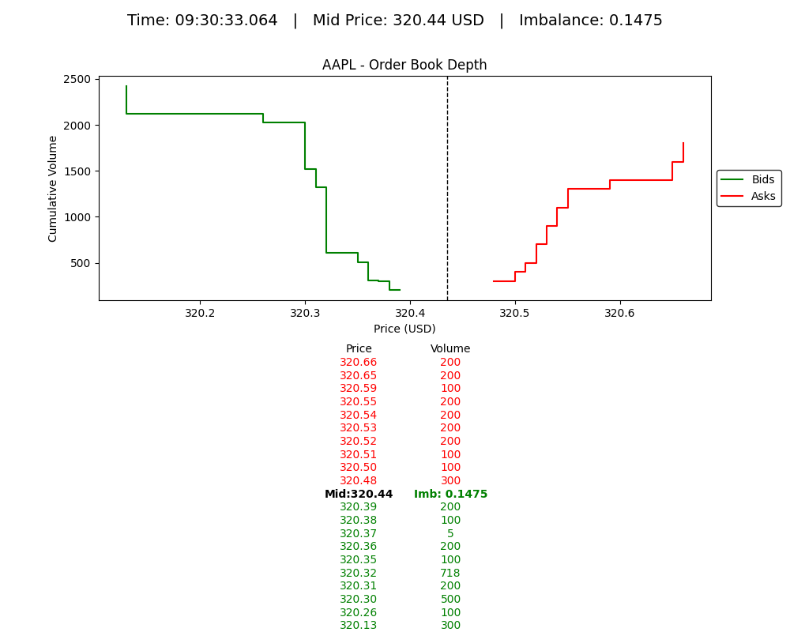
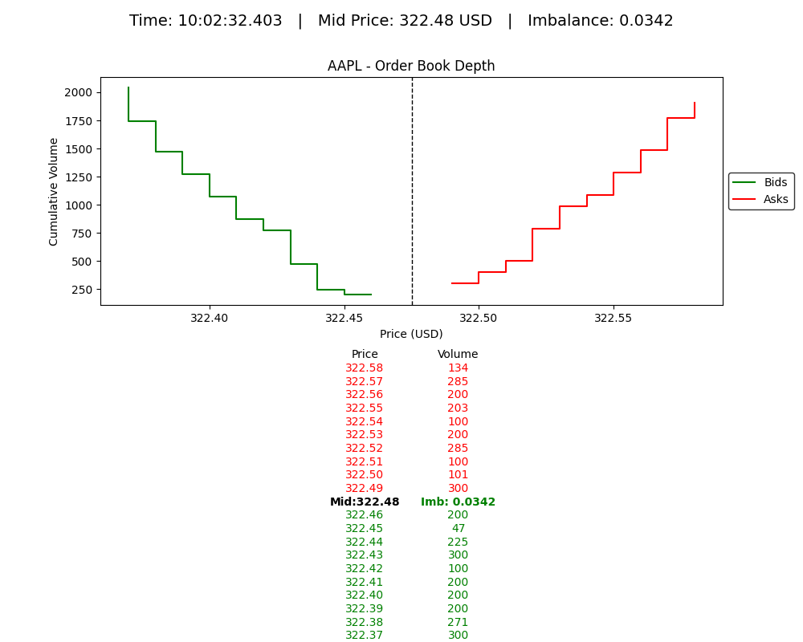

# NASDAQ ITCH 5.0 Parser and Websocket Orderbook Server and python client

A zero-copy, low-latency NASDAQ TotalView ITCH 5.0 parser written in Rust.

## Features

- **Complete Support**: Handles all 23 NASDAQ ITCH 5.0 message types
- **Zero-Copy Parsing**: Uses Unsafe for efficient binary parsing without unnecessary allocations
- **Memory-Mapped Files**: Fast access to large ITCH data files
- **Low Latency**: Optimized for high-performance market data processing
- **Websocket Simulation**: Replay historical data with realistic timing

## Installation

```bash
# Clone the repository
git clone https://github.com/suhasghorp/nasdaq-itch-orderbook.git
cd nasdaq-itch-orderbook

# Build in release mode
cargo build --release
```

## Usage

### Running the Parser

NASDAQ ITCH 5.0 historical file can be downloaded [here](https://emi.nasdaq.com/ITCH/Nasdaq%20ITCH/).
The file contains pre-market orders starting from 3:30 AM EST and regular market orders starting from 9:30 AM EST.

```bash
./target/release/nasdaq-itch-orderbook -f /path_to_unzipped_itch_file/01302020.NASDAQ_ITCH50 -s AAPL -o ./orderbooks/AAPL_orderbook.csv
```

### Running the Orderbook Websocket Server

Provide --websocket and -p flags to run the orderbook websocket server.

```bash
./target/release/nasdaq-itch-orderbook -f /path_to_unzipped_itch_file/01302020.NASDAQ_ITCH50 -s AAPL -o ./orderbooks/AAPL_orderbook.csv --websocket -p 8473
```

Options:
- `-f, --file FILE`: Input ITCH 5.0 file (required)
- `-s, --symbol SYMBOL`: Stock symbol (required)
- `-o, --output OUTPUT`: Output orderbook file (required)

## Supported Message Types

| Type | Message Type | Description |
|------|--------------|-------------|
| S | SystemEvent | System events like market open/close |
| R | StockDirectory | Stock symbol definitions |
| H | StockTradingAction | Trading halts/resumes |
| Y | RegSHORestriction | Short sale restrictions |
| L | MarketParticipantPosition | Market maker positions |
| V | MwcbDeclineLevel | Market-wide circuit breaker levels |
| W | MwcbStatus | Market-wide circuit breaker status |
| K | IpoQuotingPeriodUpdate | IPO related information |
| J | LuldAuctionCollar | Limit Up-Limit Down auction info |
| h | OperationalHalt | Exchange operational halts |
| A | AddOrder | New order added to book |
| F | AddOrderWithMpid | New order with market participant ID |
| E | OrderExecuted | Order execution (partial/full) |
| C | OrderExecutedWithPrice | Execution with price different from order |
| X | OrderCancel | Partial order cancellation |
| D | OrderDelete | Order removal from book |
| U | OrderReplace | Order modification |
| P | Trade | Non-cross trade |
| Q | CrossTrade | Cross trade execution |
| B | BrokenTrade | Trade cancellation |
| I | Noii | Net Order Imbalance Indicator |
| N | RpiiMessage | Retail Price Improvement Indicator |
| O | DirectListingPriceDiscovery | Direct Listing with Capital Raise price discovery |

### Output
```bash
2025-05-03T15:15:29.969304Z  INFO nasdaq_itch_orderbook: Processing ITCH data for symbol: AAPL
2025-05-03T15:15:29.974728Z  INFO nasdaq_itch_orderbook: File mapped: 12952050754 bytes
2025-05-03T15:15:30.163455Z  INFO nasdaq_itch_orderbook: Created Limit Orderbook for symbol: AAPL
2025-05-03T15:15:30.475260Z  INFO nasdaq_itch_orderbook::parser: Processed 10 Million messages, 32 Million messages per second
2025-05-03T15:15:30.931206Z  INFO nasdaq_itch_orderbook::parser: Processed 20 Million messages, 26 Million messages per second
2025-05-03T15:15:31.428438Z  INFO nasdaq_itch_orderbook::parser: Processed 30 Million messages, 23 Million messages per second
2025-05-03T15:15:31.929452Z  INFO nasdaq_itch_orderbook::parser: Processed 40 Million messages, 22 Million messages per second
2025-05-03T15:15:32.402297Z  INFO nasdaq_itch_orderbook::parser: Processed 50 Million messages, 22 Million messages per second
2025-05-03T15:15:32.887718Z  INFO nasdaq_itch_orderbook::parser: Processed 60 Million messages, 22 Million messages per second
2025-05-03T15:15:33.364011Z  INFO nasdaq_itch_orderbook::parser: Processed 70 Million messages, 21 Million messages per second
2025-05-03T15:15:33.866743Z  INFO nasdaq_itch_orderbook::parser: Processed 80 Million messages, 21 Million messages per second
2025-05-03T15:15:34.354235Z  INFO nasdaq_itch_orderbook::parser: Processed 90 Million messages, 21 Million messages per second
2025-05-03T15:15:34.820375Z  INFO nasdaq_itch_orderbook::parser: Processed 100 Million messages, 21 Million messages per second
2025-05-03T15:15:35.292347Z  INFO nasdaq_itch_orderbook::parser: Processed 110 Million messages, 21 Million messages per second
2025-05-03T15:15:35.825297Z  INFO nasdaq_itch_orderbook::parser: Processed 120 Million messages, 21 Million messages per second
2025-05-03T15:15:36.346950Z  INFO nasdaq_itch_orderbook::parser: Processed 130 Million messages, 21 Million messages per second
2025-05-03T15:15:36.856546Z  INFO nasdaq_itch_orderbook::parser: Processed 140 Million messages, 20 Million messages per second
2025-05-03T15:15:37.331140Z  INFO nasdaq_itch_orderbook::parser: Processed 150 Million messages, 20 Million messages per second
2025-05-03T15:15:37.835436Z  INFO nasdaq_itch_orderbook::parser: Processed 160 Million messages, 20 Million messages per second
2025-05-03T15:15:38.369033Z  INFO nasdaq_itch_orderbook::parser: Processed 170 Million messages, 20 Million messages per second
2025-05-03T15:15:38.864065Z  INFO nasdaq_itch_orderbook::parser: Processed 180 Million messages, 20 Million messages per second
2025-05-03T15:15:39.384653Z  INFO nasdaq_itch_orderbook::parser: Processed 190 Million messages, 20 Million messages per second
2025-05-03T15:15:39.902475Z  INFO nasdaq_itch_orderbook::parser: Processed 200 Million messages, 20 Million messages per second
2025-05-03T15:15:40.435653Z  INFO nasdaq_itch_orderbook::parser: Processed 210 Million messages, 20 Million messages per second
2025-05-03T15:15:40.973174Z  INFO nasdaq_itch_orderbook::parser: Processed 220 Million messages, 20 Million messages per second
2025-05-03T15:15:41.522480Z  INFO nasdaq_itch_orderbook::parser: Processed 230 Million messages, 20 Million messages per second
2025-05-03T15:15:42.038358Z  INFO nasdaq_itch_orderbook::parser: Processed 240 Million messages, 20 Million messages per second
2025-05-03T15:15:42.567348Z  INFO nasdaq_itch_orderbook::parser: Processed 250 Million messages, 20 Million messages per second
2025-05-03T15:15:43.078166Z  INFO nasdaq_itch_orderbook::parser: Processed 260 Million messages, 20 Million messages per second
2025-05-03T15:15:43.609642Z  INFO nasdaq_itch_orderbook::parser: Processed 270 Million messages, 20 Million messages per second
2025-05-03T15:15:44.176112Z  INFO nasdaq_itch_orderbook::parser: Processed 280 Million messages, 19 Million messages per second
2025-05-03T15:15:44.750992Z  INFO nasdaq_itch_orderbook::parser: Processed 290 Million messages, 19 Million messages per second
2025-05-03T15:15:45.316910Z  INFO nasdaq_itch_orderbook::parser: Processed 300 Million messages, 19 Million messages per second
2025-05-03T15:15:45.844035Z  INFO nasdaq_itch_orderbook::parser: Processed 310 Million messages, 19 Million messages per second
2025-05-03T15:15:46.363402Z  INFO nasdaq_itch_orderbook::parser: Processed 320 Million messages, 19 Million messages per second
2025-05-03T15:15:46.849406Z  INFO nasdaq_itch_orderbook::parser: Processed 330 Million messages, 19 Million messages per second
2025-05-03T15:15:47.408745Z  INFO nasdaq_itch_orderbook::parser: Processed 340 Million messages, 19 Million messages per second
2025-05-03T15:15:47.960457Z  INFO nasdaq_itch_orderbook::parser: Processed 350 Million messages, 19 Million messages per second
2025-05-03T15:15:48.520954Z  INFO nasdaq_itch_orderbook::parser: Processed 360 Million messages, 19 Million messages per second
2025-05-03T15:15:49.034642Z  INFO nasdaq_itch_orderbook::parser: Processed 370 Million messages, 19 Million messages per second
2025-05-03T15:15:49.548655Z  INFO nasdaq_itch_orderbook::parser: Processed 380 Million messages, 19 Million messages per second
2025-05-03T15:15:50.085285Z  INFO nasdaq_itch_orderbook::parser: Processed 390 Million messages, 19 Million messages per second
2025-05-03T15:15:50.642066Z  INFO nasdaq_itch_orderbook::parser: Processed 400 Million messages, 19 Million messages per second
2025-05-03T15:15:51.147423Z  INFO nasdaq_itch_orderbook::parser: Processed 410 Million messages, 19 Million messages per second
2025-05-03T15:15:51.651673Z  INFO nasdaq_itch_orderbook::parser: Processed 420 Million messages, 19 Million messages per second
Processed 423285708 messages
Wrote 1993352 orderbook updates
2025-05-03T15:15:51.930905Z  INFO nasdaq_itch_orderbook: Processing completed in 21.77s
2025-05-03T15:15:51.930930Z  INFO nasdaq_itch_orderbook: Throughput: 567.46 MB/s
```

### python visualization of LOB

```python ./visualize.py```




## License

This project is licensed under the MIT License - see the LICENSE file for details.

## References

- [NASDAQ TotalView-ITCH 5.0 Specification](https://www.nasdaqtrader.com/content/technicalsupport/specifications/dataproducts/NQTVITCHspecification.pdf)